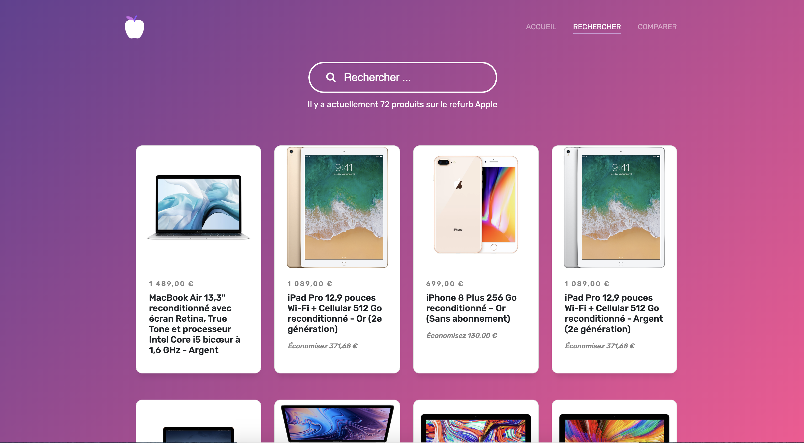
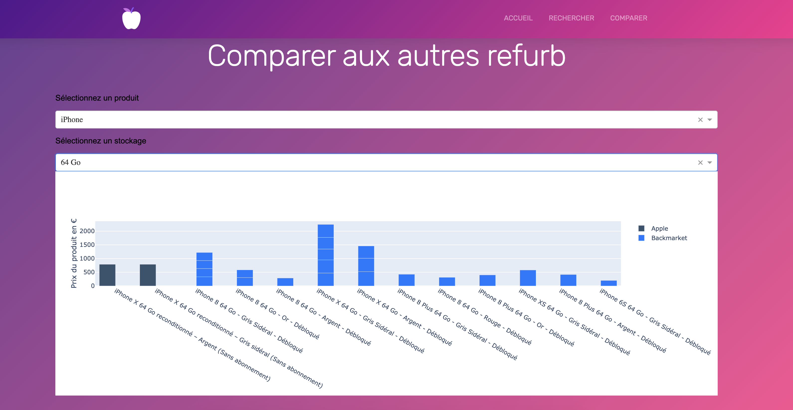

# data_engineering
This is a study project covering data engineering tools such as Flask, web scraping with scrapy, storage with mongoDB indexing and search engine with Elastic Search

# Apple Refurb project
the aim is to show products available in the apple refurb web site and compare them with another refurb website, for example Back market.

## Running the app

To run the project, first launch Docker and enter
```bash
docker-compose up -d
```
then run the python script 'web.py'
the app should be available at http://127.0.0.1:2745/

<p align= "center">

</p>

Each time the app is run, the scraping is made from the python script - more technic details available in the document "documentation_technique"

## Usage

__Search Page :__
Reach out to "rechercher" page on the top of the website. Here you can see all available products

You can also search for a specific one, the search engine provide a "Search-As-You-Type" feature that suggest you product base on the first letter you enter on the search bar.
if you only type "Iphone" you will see all the Iphone, but if you type "64" you it will show you only products with 64 Go storage

<p align= "center">

</p>

__Compare page :__

We also made a dash app integrated into our flask web app. This section helps you compare products, for example you can compare Iphone price based on the storage capacity, on apple refurb and Back Market

<p align= "center">

</p>

## Copyright
We used a HTML and CSS template for the landing page, this was made by Colorlib : https://colorlib.com